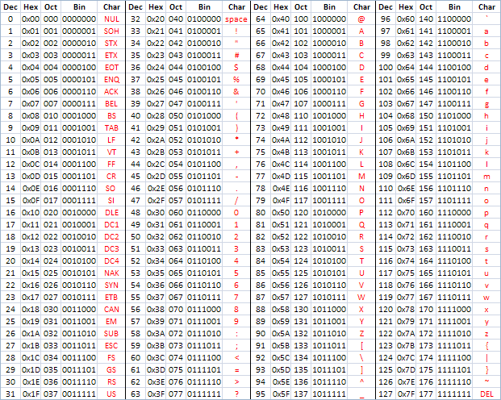

# ASCII Binary Keyboard
## IDD HW2 | Noah Pitts

### Overview

[Vimeo Demo](https://vimeo.com/233262710)

For Homework 2, I choose to build a chording text entry device where the chords represent the binary code for the extended ASCII character set. The following reference image shows the binary code for the keyboard



Normal ASCII character set is 7 bits, however the extended set uses 8 bits. This fits nicely within the constraints of the project if each bit is controlled by a digital input on the microcontroller. Each had is easily able to chord 4 bits using the four fingers (not including the thumb). The remaining the switches are used for general control in setting the bit sequence and clearing the screen.

### User Interface
#### Ergonomics
With cording it is necessary to have to use multiple fingers at a given time. Because of this, I found that it was much easier to coordinate multiple finger by having them in a more upright position. This made for a slightly arced button layout. In order to try and find an ergonomic position for cording I marked out a rough guideline on a sheet of paper with my hands in a position that I thought felt reasonably comfortable for controlling multiple fingers at a time.


#### CAD
This guide was then scanned and a more symmetrical drawing was made in a cad program. Along with the template for the keyboard, a key was made for the lower case characters and numbers that could be referenced on the physical interface. The keyboard can correctly type all of the extended ascii set (256), however this would have made for too large of a key, and so only the relevant characters for this assignment are included in the key.


#### Final Prototype
The final version for this assignment was laser cut on a piece of plywood. Internal spacers were cut on cardboard. One of the internal cardboard pieces was used to hold the buttons and the wiring was soldered directly to the back.


### Electronics
#### Prototype
The electronics for this project were initially prototyped on a breadboard using only four input bit buttons and one set button.


#### Breadboard
A virtual breadboard was used to design the circuit for all ten inputs. 8 input bit buttons and 2 control buttons.


#### Schematic
The circuit schematic was then generated from the virtual breadboard


#### Final Wiring
The final wiring was done by poking the push button switches through a piece of cardboard and wiring them together according to the schematic


### Code
The code take advantage of the fact that java chars use unicode and the low 8 bits align with the extended ascii set. Therefore all that really needs to be done is to read in the input bit button states into a boolean array when the set button is hit. Then there is a bit of bitwise shifting to get the boolean array into the correct java char. After that java handles the rest. The relevant code from the project follows.

```java
public class AsciiKeyApp extends SimplePicoPro {

    // Mapping of buttons to GPIO pins
    Gpio buttonSet = GPIO_174;
    Gpio buttonClear = GPIO_175;
    Gpio[] buttonInput = new Gpio[]{GPIO_39, GPIO_32, GPIO_35, GPIO_34, GPIO_33, GPIO_37, GPIO_128, GPIO_10};


    @Override
    public void setup() {
        // Set pins as input and set edge triggers
        pinMode(buttonSet,Gpio.DIRECTION_IN);
        setEdgeTrigger(buttonSet,Gpio.EDGE_BOTH);

        pinMode(buttonClear,Gpio.DIRECTION_IN);
        setEdgeTrigger(buttonClear,Gpio.EDGE_BOTH);

        for (Gpio button : buttonInput) {
            pinMode(button,Gpio.DIRECTION_IN);
            setEdgeTrigger(button,Gpio.EDGE_BOTH);
        }
    }

    @Override
    public void loop() {
        // Not used in this project
    }

    @Override
    void digitalEdgeEvent(Gpio pin, boolean value) {

        // Runs when the Set Button is released
        if(pin==buttonSet && value==HIGH) {
            println("BUTTON: ---> SET <---");

            // State of each input button
            boolean[] buttonState = new boolean[8];

            // Read the state of all input buttons
            for (int i = 0; i < 8; i++) {
                buttonState[i] = !digitalRead(buttonInput[i]);
            }

            char inputChar = (char)((buttonState[0]?1<<7:0) + (buttonState[1]?1<<6:0)
                          + (buttonState[2]?1<<5:0) + (buttonState[3]?1<<4:0)
                          + (buttonState[4]?1<<3:0) + (buttonState[5]?1<<2:0)
                          + (buttonState[6]?1<<1:0) + (buttonState[7]?1:0));

            printCharacterToScreen(inputChar);

            // print
            println("STATE: " + buttonState[0] + " " + buttonState[1] + " "
                    + buttonState[2] + " " + buttonState[3] + " "
                    + buttonState[4] + " " + buttonState[5] + " "
                    + buttonState[6] + " " + buttonState[7]);
            println("CHARACTER: " + inputChar);
            println("ASCII CODE: " + (int)inputChar);
        }


        // Runs when the Clear Button is released
        else if (pin==buttonClear && value==HIGH) {
            // Clear all text on screen
            clearStringOnScreen();
        }
    }
}
```
### Reflection
I learned a lot from this exercise and I have had a lot of fun trying to improve my chording speed by typing into this device. Surprisingly, with a bit of practice the input time goes up pretty quickly once you start to gain some muscle memory and recognize the patterns in ascii. My only complaint is the Sunday deadline... It should be be a weekday since sundays are hard to get ahold of equipment for debugging physical devices.
