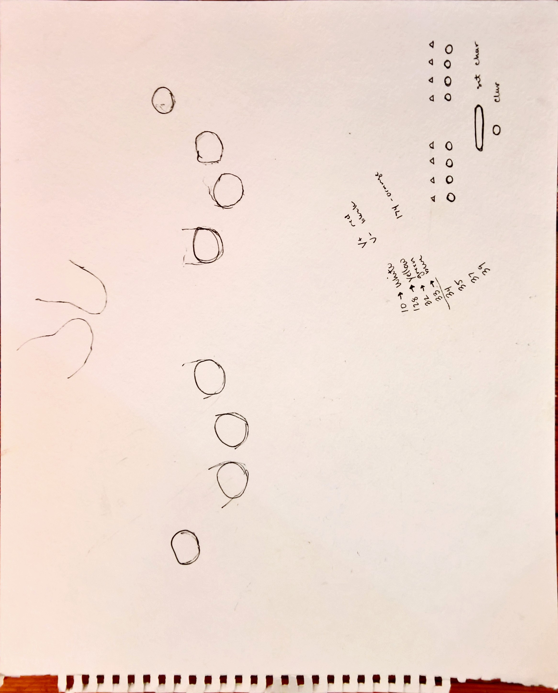

# ASCII Binary Keyboard
## IDD HW2 | Noah Pitts

### Overview

[Vimeo Demo](https://vimeo.com/233262710)

For Homework 2, I choose to build a chording text entry device where the chords represent the binary code for the extended ASCII character set. The following reference image shows the binary code for the keyboard

Normal ASCII character set is 7 bits, however the extended set uses 8 bits. This fits nicely within the constraints of the project if each bit is controlled by a digital input on the microcontroller. Each had is easily able to chord 4 bits using the four fingers (not including the thumb). The remaining the switches are used for general control in setting the bit sequence and clearing the screen.

### User Interface
#### Ergonomics
With cording it is neccessary to have to use multiple fingers at a given time. Becouse of this, I found that it was much easier to coordinate multiple finger by having them in a more upright position. This made for a slightly arced button layout. In order to try and find an ergonomic position for cording I marked out a rough guideline on a sheet of paper with my hands in a position that I thought felt reasonably comfortable for controlling multiple fingers at a time.

#### CAD
This guide was then scanned and a more symmetrical drawing was made in a cad program. Along with the template for the keyboard, a key was made for the lower case characters and numbers that could be referenced on the physical interface. The keyboard can correctly type all of the extended ascii set (256), however this would have made for too large of a key, and so only the relevant characters for this assignment are included in the key.

#### Final Prototype
The final version for this assignment was laser cut on a piece of plywood. Internal spacers were cut on cardboard. One of the internal cardboard pieces was used to hold the buttons and the wiring was soldered directly to the back.

### Electronics
#### Prototype
The electronics for this project were initially prototyped on a breadboard using only four input bit buttons and one set button.

#### Breadboard
A virtual broadboard was used to design the circuit for all ten inputs. 8 input bit buttons and 2 control buttons.

#### Schematic
The circuit schematic was then generated from the virtual breadboard

#### Final Wiring
The final wiring was done by poking the push button switches through a piece of cardboard and wiring them together acorrding to the schematic

### Code
